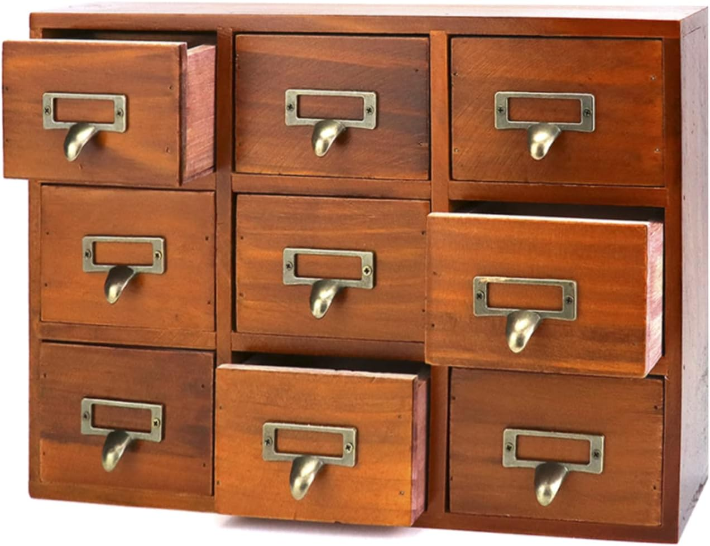

# Fusion 360 Container Grid Add-In

This add-in creates an open-top container centered on the origin with a bottom, parameterized wall thickness, compartment grid dividers, and internal fillets.

## Default Geometry

- Length (X): `92 mm`
- Height (Y / up): `60 mm`
- Depth (Z): `72 mm`
- Wall thickness: `2 mm`
- Rows: `3`
- Columns: `4`
- Bottom edge fillets: per-side controls for each compartment (`North`, `South`, `East`, `West`)
- Vertical edge fillet: one control for all compartment vertical edges (`3 mm` default)

The default `Length`, `Height`, and `Depth` values are sized for the apothecary drawers from this cabinet: [Amazon apothecary cabinet](https://amzn.to/4lQDurP).

## Reference Images

## Orientation

- Open side faces `+Y`
- Container base sits on the `X-Z` plane at `Y=0`
- Body is centered at origin in `X` and `Z`

## New to Fusion 360? Start Here

If you have never used Fusion 360 before, follow these exact steps.

### 1) Download and install Fusion 360

- Fusion 360 product page: [Autodesk Fusion](https://www.autodesk.com/products/fusion-360/overview)
- Direct download page: [Download Fusion](https://www.autodesk.com/products/fusion-360/free-trial)

Install it, then sign in with your Autodesk account and open Fusion once.

### 2) Download this add-on

- Open this repository on GitHub.
- Click **Code > Download ZIP** and unzip it.
- Keep the extracted folder somewhere easy to find.

### 3) Add this add-on to Fusion 360

1. Open Fusion 360.
2. Go to **Utilities > Scripts and Add-Ins**.
3. Open the **Add-Ins** tab.
4. Click the **+** button (or **Add Existing/Add-Ins Folder**, depending on Fusion version).
5. Select the folder that contains:
  - `ContainerGridAddin.py`
  - `ContainerGridAddin.manifest`
6. Select the add-in and click **Run**.
7. (Optional) Turn on **Run on Startup** so it loads automatically next time.

### 4) Use the add-on (simple first run)

1. Switch to the **Design** workspace.
2. In the toolbar, open **Solid > Create**.
3. Click **Create Compartment Container**.
4. Enter basic values:
  - Length (X): try `92 mm`
  - Height (Y): try `60 mm`
  - Depth (Z): try `72 mm`
  - Rows: try `3`
  - Columns: try `4`
  - Wall thickness: try `2 mm`
5. Click **OK**.
6. The container is created centered at the origin.

If you get no button in the toolbar, return to **Utilities > Scripts and Add-Ins**, select this add-in, and click **Run** again.

### 5) Export your box as an STL

After you create your box in Fusion 360:

1. In the left **Browser** panel, find the body for your container.
2. Right-click the body.
3. Click **Save as Mesh** (or **3D Print**, depending on Fusion version).
4. Set:
  - **Format**: `STL (Binary)`
  - **Units**: `Millimeter`
  - **Refinement**: `High` (or `Medium` for faster export)
5. Choose a save location and click **OK/Export**.

You now have an `.stl` file ready for slicing.

### 6) Open the STL in Bambu Studio

1. Open **Bambu Studio**.
2. Click **Open Project** or drag your `.stl` file into the build plate.
3. Select your printer profile and filament profile.
4. For a first print, common defaults are:
  - Layer height: `0.20 mm`
  - Infill: `15%` to `20%`
  - Wall loops/perimeters: `3`
5. Click **Slice Plate**.
6. Preview layers to confirm the compartments and walls look correct.
7. Click **Print Plate** (or export the sliced file) to send it to your printer.

If your box appears too large or too small in Bambu Studio, re-export from Fusion and confirm mesh **Units = Millimeter**.

## Parameters and Interfaces

The add-in keeps a single source of truth through Fusion user parameters:

- `containerLength`
- `containerHeight`
- `containerDepth`
- `wallThickness`
- `rows`
- `cols`
- `bottomEdgeFilletWest`
- `bottomEdgeFilletEast`
- `bottomEdgeFilletSouth`
- `bottomEdgeFilletNorth`
- `verticalCompartmentEdgeFillet`

Command inputs feed these parameters each run, so geometry generation and future updates rely on consistent named values.

## Internal Design Guide

- DRY: avoid duplicate geometry/math logic by centralizing calculations in helper functions.
- Single source of truth: all shared dimensions and behavior are parameter-backed.
- Open/closed: extend behavior through new helpers (new divider patterns, features) instead of rewriting core builders.
- Favor composition: build flow from focused functions (`ensure_parameters`, shell creation, divider creation, edge selection, filleting).
- Minimize side effects: isolate Fusion API mutations to build/apply functions; keep calculations pure where possible.

## Architecture Notes

Generation pipeline:

1. Validate command input.
2. Upsert user parameters.
3. Build outer solid and shell from top to create open-top container.
4. Build divider walls from interior bottom face.
5. Collect all bottom-edge segments for each compartment side and group by radius.
6. Apply grouped bottom-edge fillets only (N/S/E/W).
7. Apply a shared vertical-edge fillet across all compartment wall vertical edges.

## Changelog

- **1.0.0**
  - Added Fusion 360 add-in command and manifest.
  - Implemented parameterized container dimensions and wall/grid controls.
  - Implemented compartment divider generation and orientation constraints.
  - Implemented side-specific bottom fillets (`North`, `South`, `East`, `West`) and shared all-compartment controls in the layout editor.
  - Updated edge collection so all matching compartment bottom-edge segments are targeted for fillets.
  - Added a shared `Vertical Compartment Edges` fillet control (default `3 mm`).

